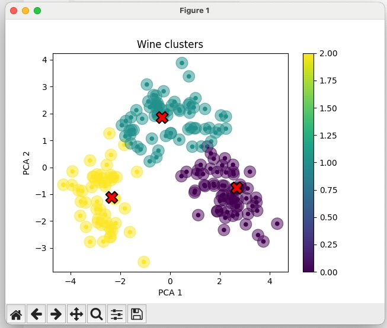

# Quick start guide

In this guide we will get started with PyFlyde by running a simple machine learning example that you can then modify and create your own projects in a similar way.

## Copying an example project and installing dependencies

Download, copy, or clode the `pyflyde` repository.

Create a new directory for your project and copy the `examples` folder into it, e.g.

```bash
mkdir testflyde
cd testflyde
cp -R ../pyflyde/examples .
```

Edit the `pyproject.toml` file that comes with the `examples` adding `pyflyde` to the dependencies and removing the dev version of `flyde` package from it, so that it looks something like:

```toml
[project]
name = "pyflyde-examples"
version = "0.0.1"
requires-python = ">= 3.9"

dependencies = [
    "pyflyde >= 0.0.7",          # Add this line
    "matplotlib",
    "pandas",
    "scikit-learn",
]

[tool.setuptools.packages.find]
# where = ["../flyde", "mylib"]  # Replace this line
where = ["mylib"]                # With this line
```

Install the dependencies:

```bash
pip install examples/ 
```

## Running the Hello World example

First, generate the component metadata for the examples:

```bash
pyflyde gen examples/
```

This will recursively scan all Python files in the `examples/` directory and generate a `.flyde-nodes.json` file with metadata for all PyFlyde components found.

Then run the example flow:

```bash
pyflyde examples/HelloPy.flyde
```

It should print "Hello Flyde!" in the console.

## Running a Machine Learning example - wine clustering

`examples/Clustering.flyde` is a more complex example which uses Pandas and Scikit-Learn to run K-means clustering on a [wine clustering dataset from Kaggle](https://www.kaggle.com/harrywang/wine-dataset-for-clustering). It's a PyFlyde version of https://github.com/Shivangi0503/Wine_Clustering_KMeans.

The component metadata should already be generated from the previous step, but if you add new components, remember to run:

```bash
pyflyde gen examples/
```

Open the `examples/Clustering.flyde` in Flyde VSCode visual editor to see how it looks like.

To run this example, use the `pyflyde` command line tool:

```bash
pyflyde examples/Clustering.flyde
```

It should print dataframe clips for  different steps of clusterization process and show a visualization at the end that looks like this:


